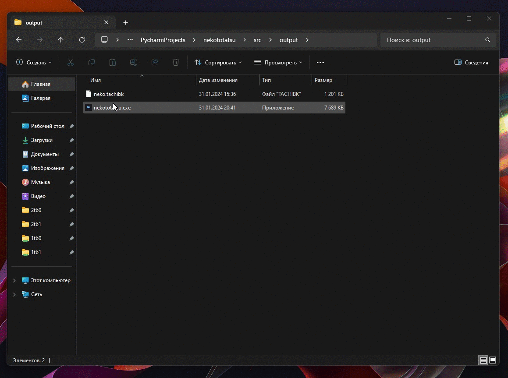

# nekototatsu

**Don't forget about the star:)**

## Info

Convert [`Neko`](https://github.com/CarlosEsco/Neko)(`*.tachibk`) files into [`Kotatsu`](https://github.com/KotatsuApp/Kotatsu)'s backup format (`zipped json`)\
Copied (not fully) from [nekotatsu](https://github.com/PhantomShift/nekotatsu), but **on python** and with **executable blobls** (nekototatsu.exe)

## Usage

From blobs ([download](https://github.com/SantaSpeen/nekototatsu/releases/download/v1.0/nekototatsu.exe)):\
Just move your `tachibk` file to an exe file



Direct: 
```bash
python main.py neko.tachibk
```

## Links

* [PhantomShift/nekotatsu](https://github.com/PhantomShift/nekotatsu) (base)
* [GitHub](https://github.com/SantaSpeen)
* [Telegram](https://t.me/id01234)
